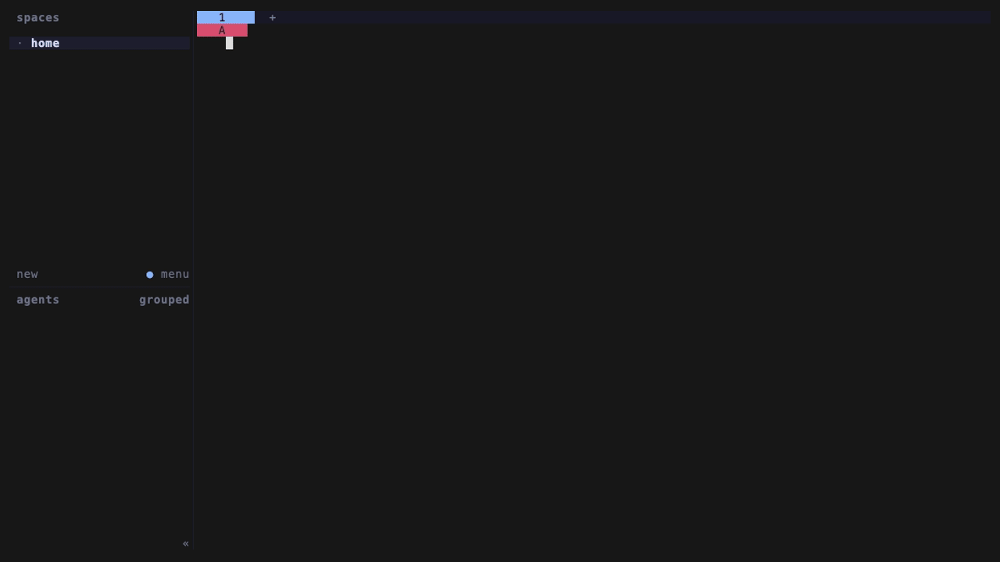

# Grid Slide

A plugin born from the idea of focusing and moving panes with hjkl.



## Features

Every action is exposed as `jeiea.grid-slide.<action>`.

| Feature                                                                                                   | Actions                                                                                                          |
| --------------------------------------------------------------------------------------------------------- | ---------------------------------------------------------------------------------------------------------------- |
| Focus the neighboring pane; at an edge, wrap to the previous/next tab (left/right) or workspace (up/down) | `focus-left`, `focus-down`, `focus-up`, `focus-right`                                                            |
| Move the focused pane the same way, crossing tab or workspace edges                                       | `move-left`, `move-down`, `move-up`, `move-right`                                                                |
| Send the focused pane to an adjacent or new tab/workspace                                                 | `to-previous-tab`, `to-next-tab`, `to-previous-workspace`, `to-next-workspace`, `to-new-tab`, `to-new-workspace` |
| Send the whole current tab to an adjacent or new workspace                                                | `tab-to-previous-workspace`, `tab-to-next-workspace`, `tab-to-new-workspace`                                     |
| Create a pane, a tab to the right, or a workspace after the current one                                   | `new-pane`, `new-tab`, `new-workspace`                                                                           |
| Reorder the current workspace                                                                             | `move-workspace-previous`, `move-workspace-next`                                                                 |
| Rearrange a tab's panes into an even grid in reading order; also runs automatically                       | `balance`                                                                                                        |

## Install

Minimum Herdr support: **0.8.0**.

```sh
herdr plugin install jeiea/herdr-grid-slide
```

## Configuration

Bind actions in `~/.config/herdr/config.toml`.

<details>
<summary>Example key bindings</summary>

```toml
[keys]
move_tab_previous = "ctrl+alt+h"
move_tab_next = "ctrl+alt+l"

[[keys.command]]
key = "alt+h"
type = "plugin_action"
command = "jeiea.grid-slide.focus-left"
description = "Focus left or wrap to previous tab"

[[keys.command]]
key = "alt+j"
type = "plugin_action"
command = "jeiea.grid-slide.focus-down"
description = "Focus down or wrap to next workspace"

[[keys.command]]
key = "alt+k"
type = "plugin_action"
command = "jeiea.grid-slide.focus-up"
description = "Focus up or wrap to previous workspace"

[[keys.command]]
key = "alt+l"
type = "plugin_action"
command = "jeiea.grid-slide.focus-right"
description = "Focus right or wrap to next tab"

[[keys.command]]
key = "alt+shift+h"
type = "plugin_action"
command = "jeiea.grid-slide.move-left"
description = "Move pane left"

[[keys.command]]
key = "alt+shift+j"
type = "plugin_action"
command = "jeiea.grid-slide.move-down"
description = "Move pane down"

[[keys.command]]
key = "alt+shift+k"
type = "plugin_action"
command = "jeiea.grid-slide.move-up"
description = "Move pane up"

[[keys.command]]
key = "alt+shift+l"
type = "plugin_action"
command = "jeiea.grid-slide.move-right"
description = "Move pane right"

[[keys.command]]
key = "ctrl+alt+k"
type = "plugin_action"
command = "jeiea.grid-slide.tab-to-previous-workspace"
description = "Move tab to previous workspace"

[[keys.command]]
key = "ctrl+alt+j"
type = "plugin_action"
command = "jeiea.grid-slide.tab-to-next-workspace"
description = "Move tab to next workspace"

[[keys.command]]
key = "alt+n"
type = "plugin_action"
command = "jeiea.grid-slide.new-pane"
description = "New pane"

[[keys.command]]
key = "alt+shift+n"
type = "plugin_action"
command = "jeiea.grid-slide.new-tab"
description = "Create tab to the right"

[[keys.command]]
key = "ctrl+alt+n"
type = "plugin_action"
command = "jeiea.grid-slide.new-workspace"
description = "Create workspace after current"

[[keys.command]]
key = "alt+m"
type = "plugin_action"
command = "jeiea.grid-slide.to-new-tab"
description = "Move pane to new tab"

[[keys.command]]
key = "alt+shift+m"
type = "plugin_action"
command = "jeiea.grid-slide.to-new-workspace"
description = "Move pane to new workspace"

[[keys.command]]
key = "ctrl+alt+m"
type = "plugin_action"
command = "jeiea.grid-slide.tab-to-new-workspace"
description = "Move tab to new workspace"

[[keys.command]]
key = "alt+shift+i"
type = "plugin_action"
command = "jeiea.grid-slide.move-workspace-previous"
description = "Move workspace previous"

[[keys.command]]
key = "alt+shift+o"
type = "plugin_action"
command = "jeiea.grid-slide.move-workspace-next"
description = "Move workspace next"

[[keys.command]]
key = "alt+."
type = "plugin_action"
command = "jeiea.grid-slide.balance"
description = "Balance in tab"
```

</details>
